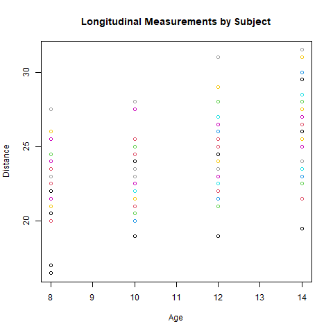

# Longitudinal Data Analysis Using Mixed-Effects Models

## Objective

The objective of this project is to analyze repeated measurements data and demonstrate the importance of using mixed-effects models when observations are correlated within subjects over time.

## Dataset

The analysis uses the Orthodont dataset available in the R `nlme` package.  
This dataset contains repeated measurements of dental distance for multiple subjects over time.

- **distance**: response variable (measurement)
- **age**: time variable
- **Subject**: individual identifier (repeated observations)
- **Sex**: grouping variable

## Methods

### 1. Naive Linear Regression

A standard linear regression model was fitted:

- Assumes independence of observations  
- Ignores repeated measurements within subjects  

This approach is inappropriate for longitudinal data.

### 2. Mixed-Effects Model (Random Intercept)

A linear mixed-effects model was fitted with:

- Fixed effects: age, sex  
- Random effects: subject-specific intercept  

This accounts for individual baseline differences.

### 3. Mixed-Effects Model (Random Slope)

An extended model was fitted allowing:

- Subject-specific slopes for age  
- Captures individual growth trajectories over time  

### 4. Model Comparison

Models were compared using AIC to evaluate goodness of fit.

## Key Findings

- Naive linear regression fails to account for within-subject correlation, leading to potentially biased estimates.
- Mixed-effects models provide a better fit by modeling subject-level variability.
- The random slope model improves flexibility by allowing different trajectories for each subject.
- Age shows a strong association with the response variable across all models.
- Model comparison indicates improved fit when accounting for subject-specific variation.

## Interpretation

This analysis demonstrates the importance of accounting for correlation in repeated measurements data.  
Ignoring the hierarchical structure (as in naive regression) can lead to misleading conclusions.

Mixed-effects models address this by incorporating random effects, allowing both population-level inference and subject-specific variability.

Such models are widely used in clinical research, longitudinal studies, and epidemiology, where repeated observations per individual are common.

## Tools Used

- R
- nlme package

## Results

### Longitudinal Data Visualization

## Author

Mayuri Chatterjee
