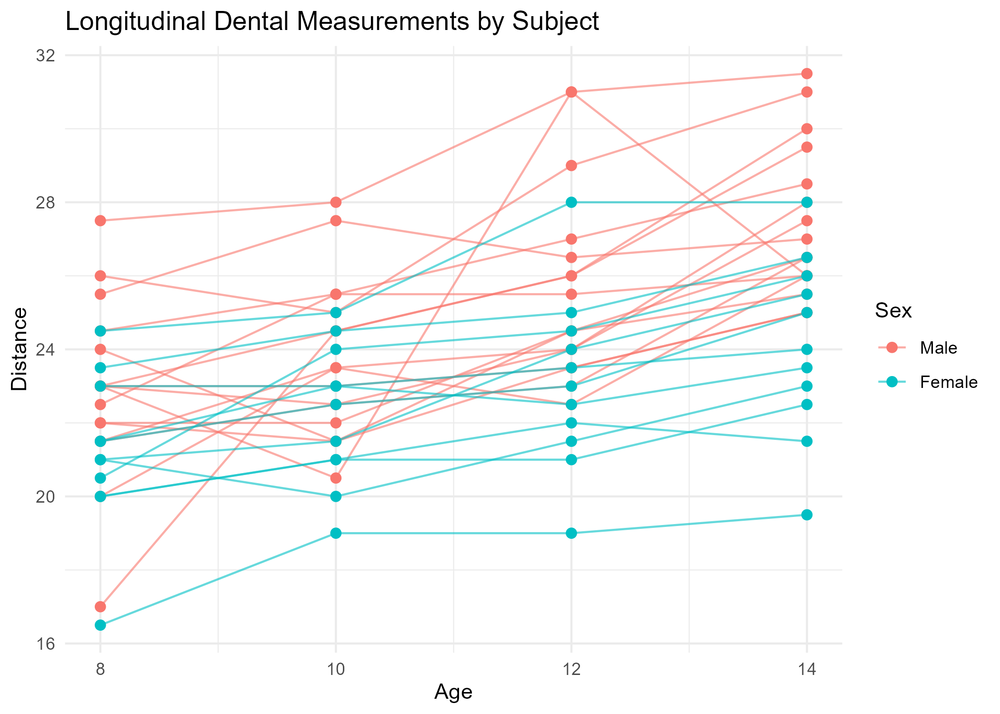

# Longitudinal Data Analysis Using Mixed-Effects Models

## Objective

Longitudinal and repeated-measurements data commonly arise in healthcare and clinical research, where multiple observations are collected from the same individual over time. In these settings, observations within subjects are correlated, making standard linear regression models inappropriate.

The objective of this project is to demonstrate how mixed-effects models account for within-subject correlation and subject-level variability in longitudinal data.

## Dataset

The analysis uses the Orthodont dataset available in the R `nlme` package.  
This dataset contains repeated measurements of dental distance for multiple subjects over time.

- **distance**: response variable (measurement)
- **age**: time variable
- **Subject**: individual identifier (repeated observations)
- **Sex**: grouping variable

## Statistical Question

How does accounting for subject-specific variability influence model fit and interpretation compared with ordinary linear regression that ignores repeated measurements?

## Methods

### 1. Naive Linear Regression

A standard linear regression model was fitted:

- Assumes independence of observations  
- Ignores repeated measurements within subjects  

This approach ignores within-subject dependence and may lead to misleading inference.

### 2. Mixed-Effects Model (Random Intercept)

A linear mixed-effects model was fitted with:

- Fixed effects: age, sex  
- Random effects: subject-specific intercept  

This accounts for individual baseline differences.

### 3. Mixed-Effects Model (Random Slope)

An extended model was fitted allowing:

- Subject-specific slopes for age  
- Captures individual growth trajectories over time  

### 4. Model Comparison

Models were compared using AIC and likelihood-based measures to evaluate goodness of fit and the impact of accounting for subject-level variability.

## Key Findings

- Naive linear regression fails to account for within-subject correlation, leading to potentially biased estimates.
- Mixed-effects models provide a better fit by modeling subject-level variability.
- The random slope model improves flexibility by allowing different trajectories for each subject.
- Age shows a strong association with the response variable across all models.
- Model comparison indicates improved fit when accounting for subject-specific variation.

## Interpretation

This analysis demonstrates the importance of accounting for correlation in repeated measurements data.  
Ignoring the hierarchical structure (as in naive regression) can lead to misleading conclusions.

Mixed-effects models address this by incorporating random effects, allowing both population-level inference and subject-specific variability.

Such models are widely used in clinical research, longitudinal studies, and epidemiology, where repeated observations per individual are common.

## Limitations

- The dataset is relatively small and primarily intended for methodological illustration.
- Linear mixed-effects models assume Gaussian random effects and residual distributions.
- More complex longitudinal settings may require generalized or Bayesian mixed-effects models.

## Tools Used

- R
- nlme package

## Results

### Longitudinal Data Visualization

## Future Work

Possible extensions include generalized mixed-effects models, multivariate longitudinal analysis, Bayesian hierarchical modelling, and robustness diagnostics for influential observations.

## Author

Mayuri Chatterjee
